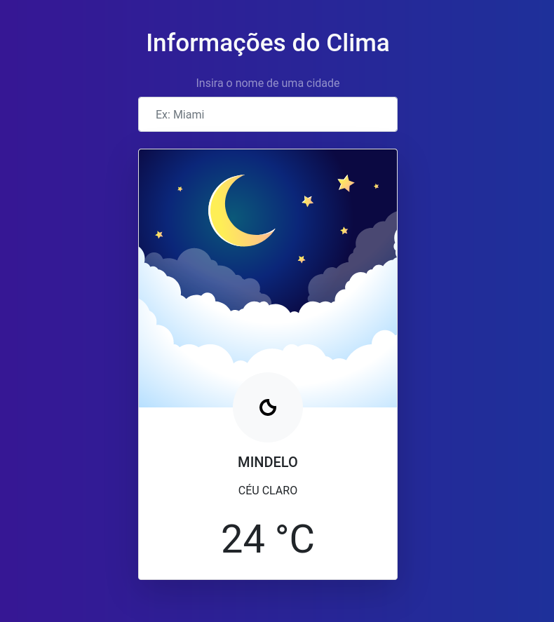

# Weather Application

Terceira aplicação desenvolvida no âmbito do [Curso de JavaScript Roger Melo - Rumo a fluência](https://github.com/roger-melo-treinamentos/curso-de-js-roger-melo/).

- [DEMO](https://weather-application-cjrm.netlify.app/)

## Tecnologies

- HMTL
- CSS - Bootstrap
- JS
